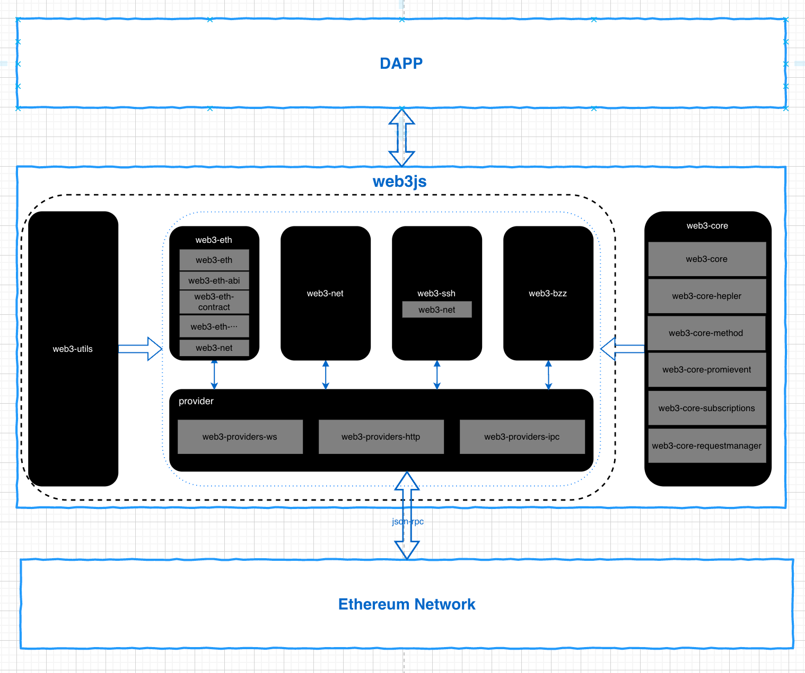

# web3.js 架构介绍

## 一、架构图

web3.js 库是一系列模块的集合，服务于以太坊生态系统的各个功能。



Dapp 通过 web3.js 可以向区块链网络中某个以太坊节点发出请求，与区块链网络进行交互。

## 二、模块分析

- web3-eth 用来与以太坊区块链及合约的交互；
- web3-shh Whisper 协议相关，进行 p2p 通信和广播；
- web3-bzz swarm 协议（去中心化文件存储）相关；
- web3-utils 包含一些对 DApp 开发者有用的方法；
- web3-net 包含一些对 DApp 开发者有用的方法；
- web3-provider web3 中当前有效的通讯服务提供器；
- web3-core web3.js 中核心逻辑处理模块；

除了 web3-core，其他模块都是可以直接调用~

### 1、web3-core（核心）

web3.js 中核心逻辑处理模块，该模块不会暴露给开发者使用，其中包含其他的子模块：

- web3-core-heplers 如 errors.js 定义 web3.js 中各种错误类型和提示；
- web3-core-method 提供 web3.js 的核心处理函数，如 request 定义 jsonrpc request 等；
- web3-core-promievent 为 web3.js 提供 promise 的调用方式；
- web3-core-sunscriptions 管理 web3 相关的订阅事件，如 subscribe 函数，可以订阅区块链中的指定事件）；
- web3-core-requestmanagerweb3.js 对以太坊各节点发送网络请求的管理中心，如根据不同请求类型（http、websocket、ipc）分发到不容子模块进行网络请求处理；

### 2、web3-provider（核心）

web3 中当前有效的通讯服务提供器，提供 http、websocket、ipc 三种网路请求方式，对应子模块：web3-provider-http、web3-provider-ws、web3-provider-ipc；
具体使用什么网络请求方式需要 web3-core-requestmanager 进行下发；

### 3、web3-net

可以与以太坊节点交互来获取网络属性。
作为 web3.js 的一个子模块，也可以单独引入使用来获取网络属性。同时 web3-eth 和 web3-shh 中单独对 web3-net 进行封装，也可以通过如 web3.eth.ent 方式使用，例如：

```javascript
var Net = require("web3-net");
// "Personal.providers.givenProvider" 在支持以太坊的浏览器中会被设置.
var net = new Net(Net.givenProvider || "ws://some.local-or-remote.node:8546");
nnet.getId();

// 或者使用 web3 包
var Web3 = require("web3");
var web3 = new Web3(
  Web3.givenProvider || "ws://some.local-or-remote.node:8546"
);
web3.eth.net.getId();
web3.shh.net.getId();
```

### 4、web3-eth（核心）

用来与以太坊区块链及合约的交互。
Dapp 的绝大部分与以太坊进行交互的操作都是基于该模块进行，web3-eth 可以作为 web3 实例的一个子模块引用，也可以作为一个单独的库进行引入使用，其中也引入了其他的 web3 子模块来丰富其能力：

- web3-eth-abi 子模块用来解码及编码为 ABI (Application Binary Interface 应用程序二进制接口) 以用于 EVM（以太坊虚拟机）进行函数调用。
- web3-eth-contract 子模块提供能力让 Dapp 与以太坊区块链上的智能合约进行交互；
- web3-eth-accounts 子模块包含用于生成以太坊账户和用来签名交易与数据的一系列函数；
- web3-eth-personal 子模块让你可以同以太坊节点上的账户进行交互；
- ···

### 5、web3-ssh

Whisper 协议相关，进行 p2p 通信和广播。
Whisper：DApps 相互通信的通信协议, 以太坊 web3 技术栈的基础层服务。
whisper 是完全基于 ID 的消息系统,它的设计目的是形成一套 p2p 节点间的异步广播系统。whisper 网络上的消息是加密传送的,完全可以暴露在公网进行传输。

### 6、web3-bzz

swarm 协议（去中心化文件存储）相关。
web3-bzz 模块 允许与去中心化文件存储进行交互。
提供了 upload（将文件夹或原始数据上传到 swarm）、download（从 swarm 上下载文件夹或原始数据）、pick（允许浏览器打开本地文件进行上传）等 api；
swarm：以太坊官方推出的存储与通讯系统，旨在为 DApp 代码、用户数据，区块链和状态数据提供去中心化和冗余存储，以及为不可追踪的通信提供了底层构造，内置的激励系统通过以太坊区块链上的智能合约实施

### 7、web3-utils

为以太坊 DApp 和其它的 web3.js 包提供了工具性函数。
如以太币单位转换函数 toWei 等；

参考

- [Github web3js 源码](https://github.com/web3/web3.js/tree/1.x)
- [web3js 中文文档](https://learnblockchain.cn/docs/web3.js/index.html)
- [深入 ethereum 源码-whisper 协议解读](https://zhuanlan.zhihu.com/p/53371420)
- [JSON-RPC API](https://hyperchain.readthedocs.io/zh_CN/stable/JSON-RPC_manual.html)
